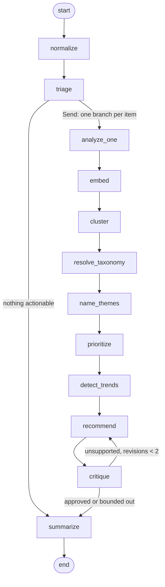

# 📊 Sentilytics

**Turns a customer feedback firehose into a ranked list of what to fix this week, with the evidence attached.**

---

## The problem

Feedback arrives continuously, as unstructured text, from everywhere at once — support
tickets, NPS responses, app store reviews, sales calls, Slack. Nobody can read all of
it, so roadmap decisions get made from anecdote instead of aggregate. The loudest
customer in last week's call gets a fix; the issue quietly mentioned by forty people
doesn't, because nobody counted.

Per-item sentiment analysis doesn't solve this. *"68% negative"* is a chart, not a
decision. The unit a product manager can act on is a **theme with volume, trajectory,
and blast radius**:

> **OAuth signup fails for enterprise accounts** — 34 mentions, 3× since Tuesday's
> release, 9 of them paid.

That sentence gets a ticket filed before lunch. Producing it is what this does.

---

## How it works

A LangGraph pipeline with conditional routing, map-reduce fan-out, and a bounded
self-correction cycle.



| Node | Does |
|---|---|
| `normalize` | Trim, collapse whitespace, drop exact duplicates |
| `triage` | Heuristic noise rejection; drives the conditional edge |
| `analyze_one` | Sentiment, emotion, intent, severity, feature area, churn risk — one structured call per item, fanned out concurrently |
| `embed` | One batched embedding call for the whole run |
| `cluster` | Agglomerative clustering over embeddings — the actual grouping |
| `resolve_taxonomy` | Match clusters to stored themes by centroid similarity |
| `name_themes` | Name only the genuinely new clusters, and persist them |
| `prioritize` | Impact = weighted reach × severity × churn multiplier |
| `detect_trends` | Compare against trailing runs: emerging / spiking / declining |
| `recommend` | Product actions grounded in the themes |
| `critique` | Audits those actions against the evidence; loops back if unsupported |
| `summarize` | The Monday-morning brief |

### Design notes

- **Clustering is agglomerative, not HDBSCAN.** HDBSCAN is the fancier answer and
  better on large corpora, but it labels most points as noise on a ten-item batch,
  which reads as broken. Agglomerative with a cosine threshold needs no `k` and
  degrades gracefully at demo scale.
- **Deduplication is exact-match only, never semantic.** Forty people reporting the
  same bug in forty phrasings is forty mentions. Collapsing them would destroy the
  volume signal the whole product rests on.
- **Themes persist across runs.** Each cluster centroid is compared against stored
  theme centroids; above the merge threshold it *is* that theme and keeps its name.
  Without this there is nothing stable to compare against, and "is this getting
  worse?" is unanswerable.
- **Trends compare share of run, not raw count.** Otherwise uploading a bigger file
  next week reports every theme as spiking. Below three prior runs it reports
  `insufficient_history` rather than inventing a percentage.
- **The critique cycle is bounded at 2 revisions.** Unbounded cycles are how a
  LangGraph demo hangs in front of an audience.

---

## Stack

- **Backend** — Python, FastAPI, LangGraph
- **Chat model** — Llama 3.3 70B via Groq (structured output throughout)
- **Embeddings** — Google `text-embedding-004`
- **Clustering** — scikit-learn
- **Storage** — SQLite via async SQLAlchemy
- **Frontend** — Next.js 15, Tailwind, shadcn/ui

---

## Running it

```bash
git clone https://github.com/pratham-srivastava-07/saas-ffedback-agent.git
cd saas-ffedback-agent

python -m venv venv
source venv/bin/activate        # venv\Scripts\activate on Windows

pip install -r requirements.txt

cp .env.example .env            # add GROQ_API_KEY and GOOGLE_API_KEY

uvicorn app.main:app --reload
```

The database is created on first start. No Docker, no cloud account.

Frontend:

```bash
cd ui
npm install
echo "NEXT_PUBLIC_API_URL=http://localhost:8000" > .env.local
npm run dev
```

### Tests

```bash
pip install -r requirements-dev.txt
pytest
```

The suite runs entirely against a fake chat model and a fake embedder that derives
deterministic vectors from text — no API key, no network, no cost, and stable
clustering assertions.

---

## API

| Endpoint | Purpose |
|---|---|
| `POST /analyze` | Run the pipeline, return the full result |
| `POST /analyze/stream` | Same, streamed as SSE per node — consume with `fetch` + `ReadableStream` |
| `GET /themes` | The accumulated taxonomy across all runs |
| `GET /themes/trends` | Per-theme history for sparklines |
| `GET /runs`, `GET /runs/{id}` | Run history |
| `GET /graph` | The live pipeline topology as mermaid |

Requests are bounded at 200 items and 5000 characters per item.

---

## Not built

Auth, multi-tenancy, billing, and ingestion connectors (Zendesk, Intercom, App Store).
Each is its own project. The pricing page in the UI is presentational.
